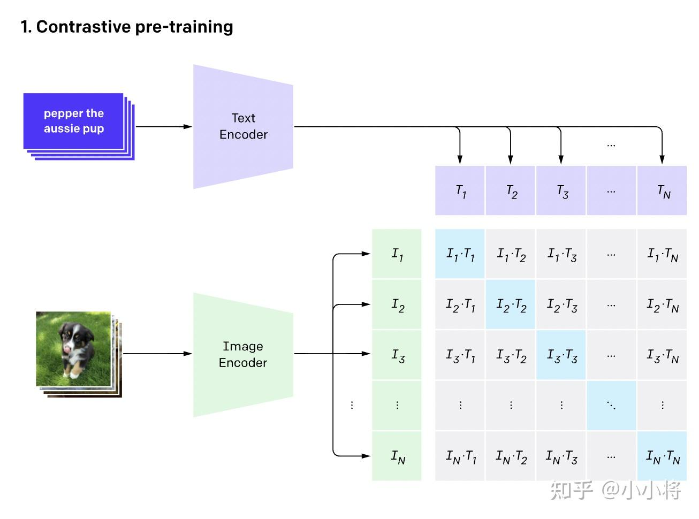
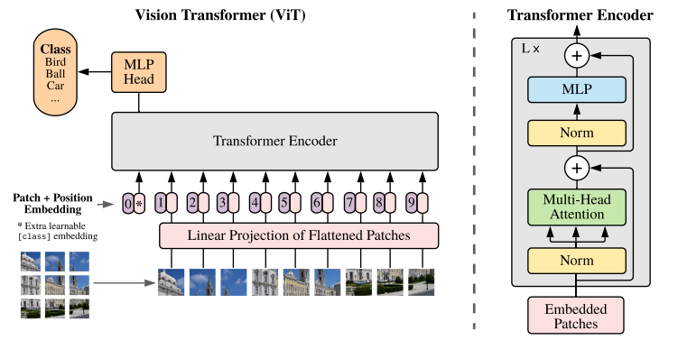
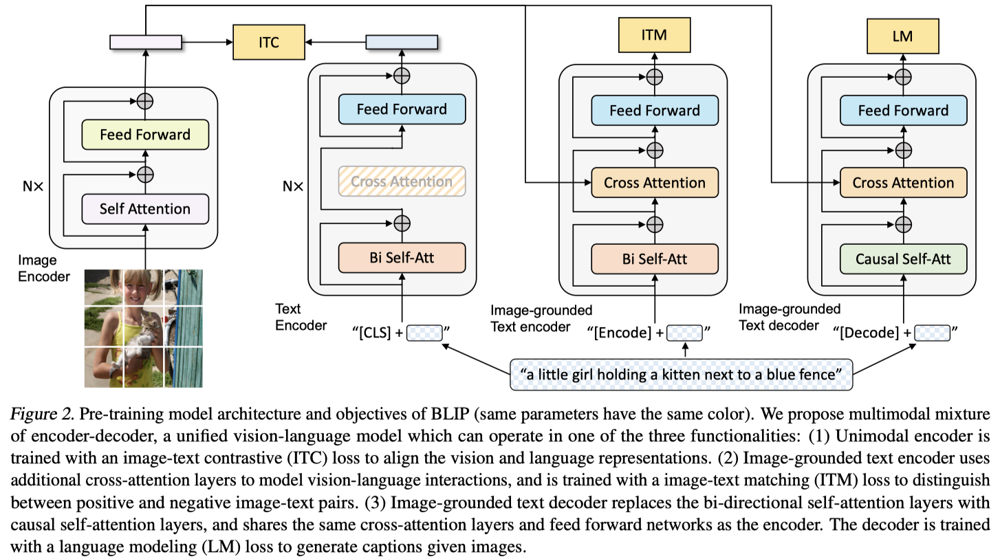

#### 多模态学习笔记

##### Transformer

- 是一个方便利用注意力机制，可以处理长序列的问题；

##### 多模态内容

- 主要部分/模态：文字，图片，音频；
- 关键技术：特征表示，特征提取与对齐，融合，预测。
  - 多模态表征：
    - 

  - 跨模态对齐：
    - 

  - 多模态融合：
  - 推理：
  - 生成：
  - 迁移：
  - 

- 跨模态实例
  - language - audio ：给定文本，生成语音；给定语音，生成文本；
  - vision - audio ：给定视频，进行语音识别、声源定位；给定声音，生成图像、视频等；
  - vision - language：图像/文本的相互检索；给定图像，生成文本；给定文本，生成图像；
  - 视觉任务：目标检测，目标识别，目标分割，目标定位；
  - 语言任务：
  - 语音任务：

- CLIP（Contrastive Language-Image Pre-training）

  - 用途：图像+文字+对比学习；对比文本图像对的预训练方法或者模型；

  - 训练数据：文本-图像对；从而学到文本-图像的匹配关系；

  - 特点：zero-shot图像分类，不需要训练数据，可以直接在下游任务实现分类；

  - 网络结构

    

- ViT(Vision Transformer)（以图像分类任务为例）

  - 目的：实现对图像的分类

  - 网络结构

    

    可以看到，把图片分为固定大小的batch，即为输入序列；每个batch的维度为N * N * 3（尺寸*通道）；同时，因为Transformer对位置不敏感，在每一个batch前面加上序列号；

  - CNN与Transformer

    - CNN局部感受野好，参数少，现有积累丰富；
    - Transformer的整体联系好，但是参数多；在NLP方面表现很好，所以希望在CV领域使用Transformer，从而方便与NLP直接联合，进一步方便多模态的理解与实现

  - 效果评价：与CNN比消耗更大，且直接应用效果不如CNN；但是当训练数据规模够大的时候，之后使用微调，效果会更好；

  - Blip：将图像信息放入NLP部分处理，从而达到融合目标；

    

- SAM(Segment Anything)
  - 零样本学习 
